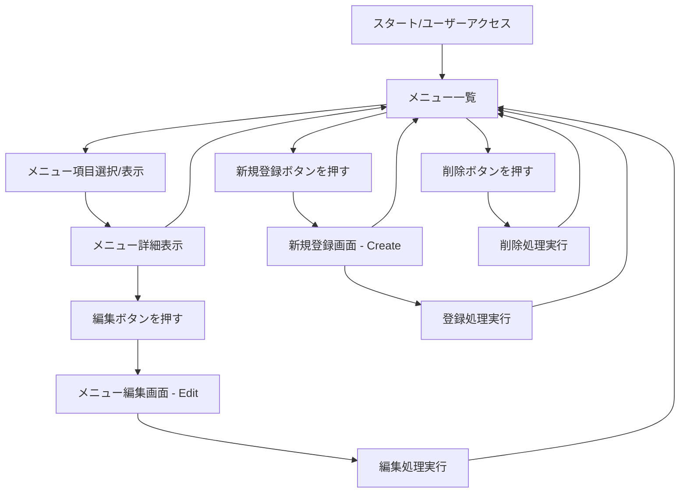

#　利用者

## アプリケーションの利用方法

代表的なシステムの一つを貼り付けてプログラムを行ったことのない一般人でもわかるレベルでの簡単な利用方法を画像を用いて説明する．


```html

```
# 管理者

## 説明
サービスを立ち上げる人が読むことを意識した説明文を記述する．一つのシステムだけを説明する．

## 基本構造


# 開発者

システムを三つ掲載する


### ページ遷移の基本構造

