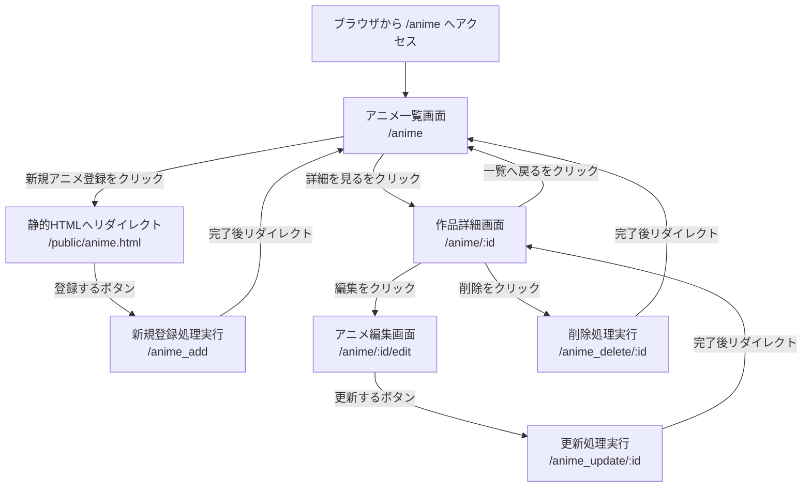

# github
[Google](https://github.com/ryouskino2006-design/kimatu.git)

#　利用者用説明書

## 昼食メニュー登録アプリケーションについて

このアプリケーションは毎日の昼食のメニューを店舗，金額，感想に分けて登録することで普段食べているものを一気見することができるアプリケーションとなっている．また使用方法を以下に記述する．

## 利用方法
この昼食メニュー登録アプリケーションについて利用方法を以下に記述する．

### アクセス方法

使用する検索エンジンをgoogleとする．以上の写真に示しているのはブラウザのアドレスバーになっている．このアドレスバーに http://localhost:3000/menu を入力する．すると次のような昼食のメニューをそれぞれ表示した一覧表示ページに遷移する．

### 詳細表示・編集・削除
上記のシステム・メニュー欄に遷移するとそれぞれのID/店名/メニュー名/金額/詳細が表示される．この中で**詳細を見る**を押すと次のメニュー詳細欄に遷移することができる．

詳細表示からは詳細表示したメニューについて編集・削除を行うことが可能となっている．上記のメニュー詳細欄から**編集する**を押すと次のメニュー編集フォームに移行する．

ここから自らの登録したメニューについて店名・メニュー名・金額・備考を編集し**内容を更新する**を押すとメニュー詳細に戻り内容の変更が確認することができる．

また登録したメニューの削除を行いたい場合メニューの詳細から編集するの隣にある**削除する**を押すことで次の削除の確認を行うことができる．

ここではカレーを削除を実行する．ここでOKを押すと一番最初のメニュー一覧に戻るようになっている．

メニュー一覧を見るとカレーが削除されていることが確認できる．

###　新規メニューー登録方法
ここでは新規メニューの登録方法を説明する．まずは最初の一覧表示ページの**新規メニュー登録**を押す．

すると次の新規メニュー登録フォームに移行するので下記のようにそれぞれ店名，メニュー名，金額，備考を書いて**メニューを更新する**を押す．ここでは学食の汁なし担々麺うどん350円を登録する．

すると最初の一覧表示ページに戻り一番したの五番目のメニューとして汁なし坦々うどんが350円で登録されていることが確認できる．

# 管理者

## 説明
ここでは一覧表示をベースとした詳細表示・編集・登録・削除機能を持つシステムをダウンロードして運用する方法までの解説を行う．

###　ダウンロード・運用方法
まず下記に示しているリンクより自らの必要としているシステムをanime，game,mesiの三つのファイルの中から選びダウンロードをする．ここではgameをダウンロードしたこととする．
[Google](https://github.com/ryouskino2006-design/kimatu.git)
次にダウンロードしたgameがどこのディレクトリに入っているのか確認する．ここでは下の写真からダウンロードの中のwebprogram内のkimatuのファイルの中にgameが入っており，その中にpublic，views,game.jsが入っているのことがわかる．

ダウンロードしたものが入っている場所が分かったら次にターミナルを立ち上げる．ターミナルでは以下のように**cd**コマンドを用いてanimeのファイルにいく．

この際**ls**コマンドを打つとanimeファイルの中に入っているものが先ほどのダウンロードしたものと一致すると確認すると良い．

次にこのディレクトリ内でシステムを起動するのに必要な依存モジュールをインストールする以下のコマンドを打つ．
**npm init -y**
**npm install express ejs**

これを行なった後node anime.jsを入力し以下のようにターミナルに Anime app listening on port 8080! と表示されれば，正常に起動している．

# 開発者

### データ構造
各データはJavaScriptのオブジェクト配列としてメモリ上に保持される．

共通仕様: すべてのデータに一意の id を付与し，nextId 変数によって重複のない採番を行っている．

リソース別データ項目:

アニメ: Genre（ジャンル），name（作品名），note（感想）

ゲーム: Genre（ジャンル），name（タイトル），note（感想）

昼食: shop（店名），menu（メニュー名），price（金額），note（備考）

###　リソースごとの機能詳細
各リソース管理プログラム（anime.js, game.js, menu.js）は，Expressフレームワークを用いて以下の機能を共通実装している．

動的生成（res.render）: EJSテンプレートエンジンを用い，サーバー内の配列データをHTMLへ埋め込むことで動的な画面生成を行う．

リダイレクト（res.redirect）: データの追加・削除・更新といったデータ操作を伴うリクエストの完了後，res.redirect を実行してブラウザを一覧または詳細画面へ自動遷移させる．これにより，リロードによるデータの二重登録を防止している．

静的ファイル配信（express.static）: 登録フォーム等の初期データが不要な画面は，public ディレクトリ内のHTMLを直接配信することでサーバー負荷を軽減している．

またそれぞれのファイルで担当している機能については以下の通りである．

**anime.js**	サーバーサイドの全論理を担当する司令塔である．各画面へのルーティング，データの加工，処理実行後のリダイレクト指示を行う．

**public/anime.html**	新規データを入力するためのフォーム画面である．初期データが不要なため，サーバー負荷を抑える静的HTMLとして配信している．

**views/anime_detail.ejs**	特定のIDに基づいた詳細情報を表示する画面である．ここを起点として編集や削除の操作へ繋げる役割を持つ．またデータ削除する際は onclickを用いてユーザーに確認を行うことで意図しない削除が行われないようになっている．
を用いてユーザーに
**views/anime_edit.ejs**	既存データを修正するための画面である．現在の値をフォーム内に保持した状態で表示し，ユーザーによる再入力を受け付ける．

**views/anime_list.ejs**	登録された全データをテーブル形式で動的に出力する画面である．各データへの詳細表示リンクや，新規登録画面への導線を提供する．

**public/anime.html**	新規データを入力するためのフォーム画面である．初期データが不要なため，サーバー負荷を抑える静的HTMLとして配信している．

###　プログラムについて

基本原則: すべてのJavaScriptファイルの先頭に "use strict"; を記述し，安全なコード記述を徹底した．

通信仕様: サーバーとブラウザ間のすべてのやりとり（表示，追加，削除，編集）は，app.get メソッドによるルーティングで統一している．

findによる検索: const findMenuById = (id) => lunchMenu.find(menu => menu.id === parseInt(id)); 詳細表示や編集画面において，URLパラメータのIDに合致する「データそのもの」を抽出する際に使用している．

findIndexによる位置特定: const findMenuIndexById = (id) => lunchMenu.findIndex(menu => menu.id === parseInt(id)); データの更新（上書き）および削除（splice）において，対象が「配列の何番目か」というインデックス情報を取得するために使用している．

### ページ遷移の基本構造
本システムは，ユーザーが直感的に操作できるよう，全機能で共通の遷移モデルを採用している．

遷移のトリガー:
テキストリンク: ページ間の移動（「詳細を見る」「一覧へ戻る」など）．
フォームボタン: GETメソッドによるデータ送信と処理の実行．
HTTPメソッドとパス設計:
実装の簡略化のため，追加・更新・削除の全操作を GETメソッド で統一している．
パス命名規則：/[リソース名]_[アクション]（例: /anime_add, /menu_update）
処理実行後のレスポンス:
追加・削除処理後: 全体像を把握させるため，一覧表示画面へリダイレクトする．
編集（更新）処理後: 変更内容を即座に確認させるため，詳細表示画面へリダイレクトする．

具体的なページ遷移は以下に示す今回開発した３つのシステムのそれぞれのページ遷移について記述した．
まずページ遷移の全体は以下の図ようになっており，ユーザーがアクセスすると一覧表示が行われる．そこからユーザーは**詳細をみる**を押すと詳細表示，**登録**を押すとシステムに物を登録することができる．詳細表示からは編集，削除，一覧表示への回帰を数rことができる．編集では**編集**をクリックすると編集ページに移行し，終了後再び詳細ページに戻る．削除では削除確認を行なったのち一覧表示に戻る．登録では**登録**を押すと登録フォームに移行する．フォームにて必要なデータを入力後元の一覧表示ページに戻る．

**例としてアニメ登録システムのパスと上記に示したページ遷移の図を示す．**

```mermaid
graph TD
    %% メイン画面
    Start[ブラウザから /anime へアクセス] --> List[アニメ一覧画面<br/>/anime]

    %% 新規登録のフロー
    List -->|新規アニメ登録をクリック| NewRedirect[静的HTMLへリダイレクト<br/>/public/anime.html]
    NewRedirect -->|登録するボタン| AddProcess[新規登録処理実行<br/>/anime_add]
    AddProcess -->|完了後リダイレクト| List

    %% 詳細表示のフロー（ここが起点）
    List -->|詳細を見るをクリック| Detail[作品詳細画面<br/>/anime/:id]
    
    %% 詳細画面からの3つの動線
    Detail -->|一覧へ戻るをクリック| List
    
    Detail -->|編集をクリック| Edit[アニメ編集画面<br/>/anime/:id/edit]
    Edit -->|更新するボタン| UpdateProcess[更新処理実行<br/>/anime_update/:id]
    UpdateProcess -->|完了後リダイレクト| Detail

    Detail -->|削除をクリック| DeleteProcess[削除処理実行<br/>/anime_delete/:id]
    DeleteProcess -->|完了後リダイレクト| List
```

