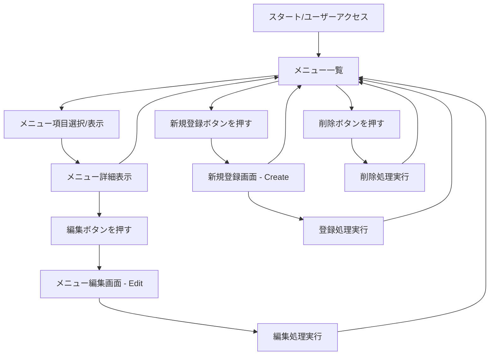

#　期末にて提出する予定のプログラムの設計・タスクリスト

##　作成プログラム

### 昼飯
普段自分が行っている昼飯のメニューについて食べられる店・価格・感想や備考をデータとして登録する．

### アニメ
自らの見たことあるアニメをジャンル，評価，感想・備考をデータとして登録する．

###　ゲーム
自らのやったことのあるゲームをジャンル，評価，価格，感想備考をデータとして登録する．

以上のコンセプトを軸に登録，編集，削除，編集，詳細閲覧の機能を持ったプログラムを作成する．

以下をその基本構造とする

## タスクリスト

行う作業を整理するために，タスクリストを作成できる．

- [ ] 開発者向けドキュメントの作業
  - [ ] 対象とするシステムの決定 :thinking:
  - [ ] データ構造の決定 :thinking:
  - [ ] ページ構造の検討 :thinking:
  - [ ] ページ遷移の検討 :thinking:
  - [ ] HTTPメソッドとリソース名の決定
  - [ ] ページ遷移図の作成 :writing_hand:
  - [ ] ページ構造の決定
  - [ ] ドキュメントの構成の検討 :thinking:
  - [ ] 概要 :writing_hand:
  - [ ] HTTPメソッドとリソース名一覧 :writing_hand:
  - [ ] データ構造 :writing_hand:
  - [ ] リソース名ごとの機能の詳細 :writing_hand:
- [ ] 管理者向けドキュメントの構成
  - [ ] インストールから起動までの手順確認 :computer:
  - [ ] インストール方法 :writing_hand:
  - [ ] 起動方法 :writing_hand:
  - [ ] 起動できない場合 :writing_hand:
  - [ ] 終了方法 :writing_hand:
  - [ ] 分かっている不具合 :writing_hand:
- [ ] 利用者向けドキュメントの作業
  - [ ] 構成の検討 :thinking:
  - [ ] スクリーンショットの保存と整理 :computer:
  - [ ] 概要 :writing_hand:
  - [ ] 使用できる機能 :writing_hand:
  - [ ] 起動画面 :writing_hand:
  - [ ] 一覧表示 :writing_hand:
  - [ ] 詳細表示 :writing_hand:
  - [ ] データ追加 :writing_hand:
  - [ ] データ削除 :writing_hand:
  - [ ] データ編集 :writing_hand:
- [ ] 提出 :tada: